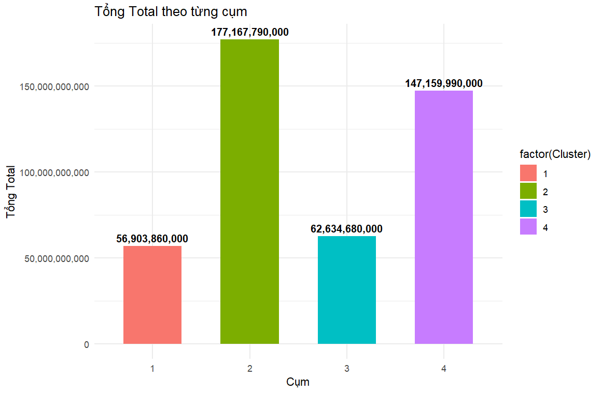
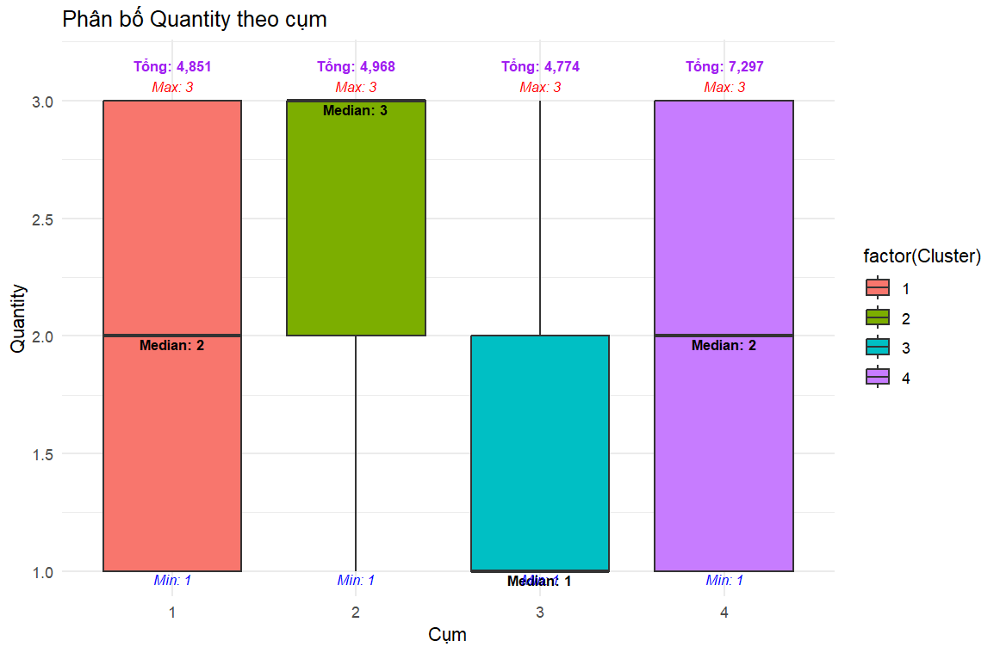
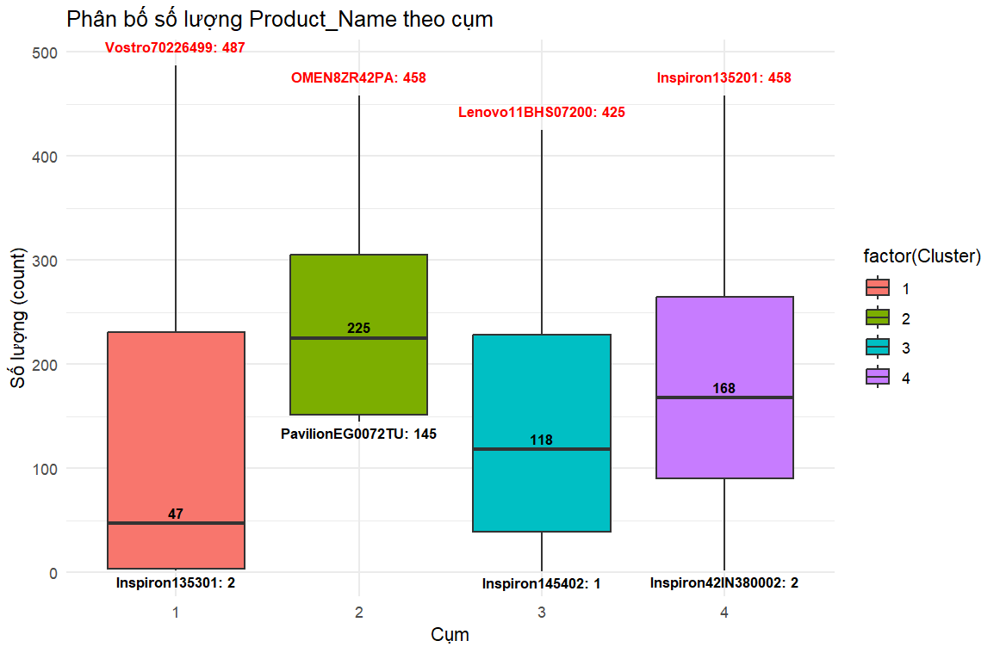
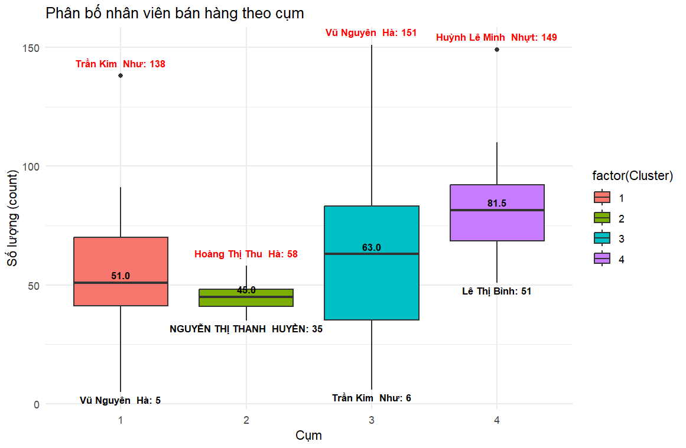
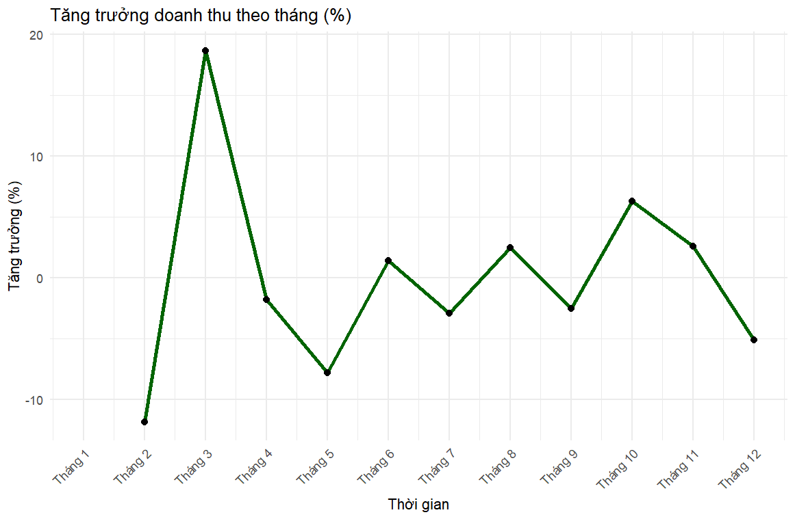
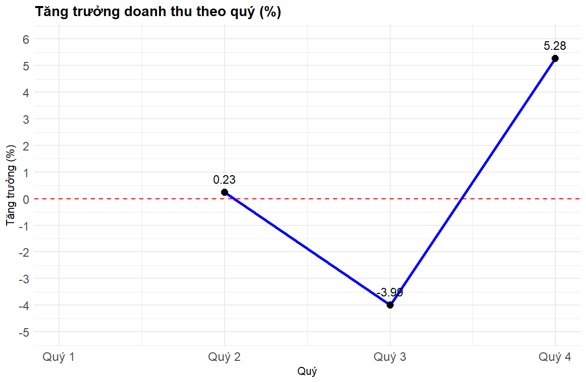
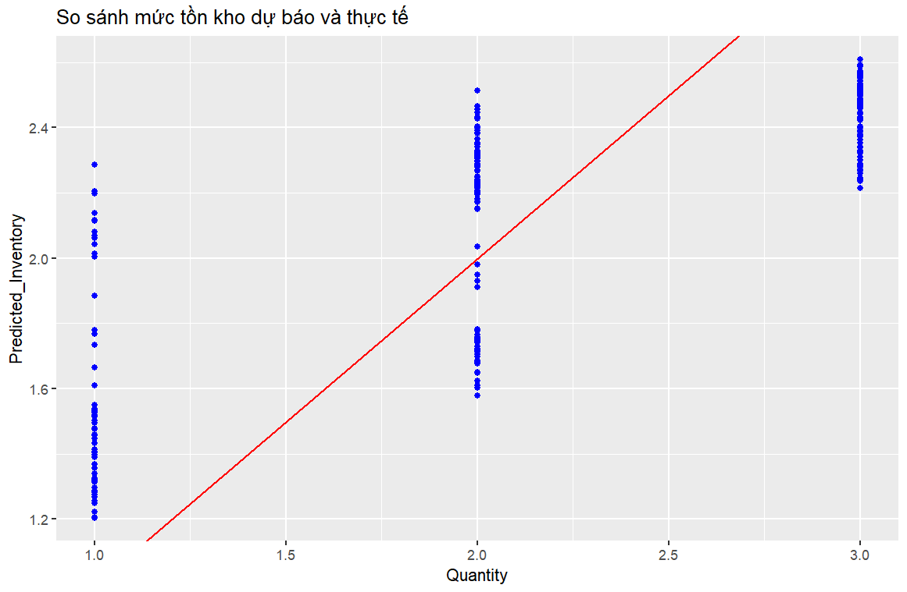

# Laptop Retail Sales Analytics & Demand Forecasting System

> End-to-end analytics project on 10,902 real-world sales transactions from a
> Vietnamese multi-branch laptop retail chain — covering mixed-type clustering,
> 14 business intelligence analyses, time series forecasting, and Random Forest
> inventory optimization using R.

---

## Overview

| Property | Detail |
|---|---|
| Dataset | 10,902 transactions · 11 features · Year 2020 |
| Branches | 5 (Ho Chi Minh City, Hanoi, Da Nang, Can Tho, Hai Phong) |
| Brands | HP, Dell, Lenovo |
| Price range | 8.9M – 54M VND |
| Avg transaction | ~40.7M VND |
| Language | R |

---

## Cluster Summary (K-Prototypes, k=4)

| Cluster | Avg Price | Avg Total | Product Type | Dominant Brand |
|---|---|---|---|---|
| 1 | ~11.9M VND | ~23.7M VND | Desktop (86%) | Dell (64%) |
| 2 | ~37.3M VND | ~89.9M VND | Laptop (100%) | HP (54%) |
| 3 | ~13.8M VND | ~21.5M VND | Desktop (65%) | Lenovo (66%) |
| 4 | ~22.0M VND | ~40.7M VND | Laptop (96%) | Mixed |

---

## Visualizations

### Revenue by Cluster


### Quantity Distribution by Cluster


### Best/Worst Product by Cluster


### Salesperson Performance by Cluster


### Monthly Revenue Growth Rate


### Quarterly Revenue Growth Rate


### Random Forest: Predicted vs Actual Inventory


---

## Methodology

### 1. Data Preprocessing
- Coerced Price, Quantity, Total to numeric
- Generated one-hot dummy variables via `fastDummies`
- Validated: **0 missing values** across all 11 columns

### 2. Branch Aggregation
Summarized each of 5 branches by Total Revenue, Avg Quantity,
Total Transactions, and Unique Products sold.

### 3. Clustering — Two Approaches

**Hierarchical Clustering on branch aggregates:**
- Gower distance matrix (`daisy`) → Ward.D2 linkage → k=4 cut

**K-Prototypes on transaction records (k=4, seed=123):**
- 9 mixed-type features (Month, Saler_Name, Branch_Name,
  Product_Name, Price, Product_Brand, Product_Type, Quantity, Total)
- Handles continuous + categorical variables simultaneously

### 4. Business Intelligence (14 analyses)
- Best-selling product per month (all 12 months)
- Top 5 salespeople: Kiều Ngọc Các & Trịnh Thị Thu Hằng (551 units)
- Bottom 3 salespeople: Lê Thị Bình (424), Hồ Thị Khánh Huyền (440), Trần Lê Phương Dung (450)
- 21 salespeople performing below company average
- Best product per branch: Pavilion180S1AA (Cần Thơ), Vostro70226499 (Hà Nội), Gaming81LK01J3VN (Hải Phòng), Inspiron135201 (HCM), Ideapad82H700DNVN (Đà Nẵng)
- Brand ranking: Lenovo (7,332) > HP (7,312) > Dell (7,246)
- Monthly revenue growth: peak +18.7% (Feb→Mar), trough -11.9% (Jan→Feb)
- Quarterly growth: Q4 strongest at +5.28%

### 5. Time Series Forecasting (12-month horizon)
- auto.ARIMA(0,0,0) + ETS models on monthly revenue ts (freq=12)
- ARIMA forecast: 36,988,860,000 VND/month
- ETS forecast: 37,063,087,470 VND/month
- Side-by-side comparison table for all 12 forecast months (2021)

### 6. Inventory Demand Forecasting per Branch
- Per-branch ARIMA on Avg_Quantity time series
- 6-month demand forecast per branch

### 7. Random Forest Inventory Optimization
- Features: Branch_Name, Product_Brand, Total → Target: Quantity
- 70/30 train-test split (set.seed=123), ntree=50
- **Pearson correlation: 0.8506** between predicted and actual

---

## Key Findings

- **Cluster 2** (high-end laptops ~37.3M VND mean price) generates
  ~89.9M VND avg total per transaction — premium segment dominates revenue
  despite lower volume.
- **Ho Chi Minh City** leads with 3,254 transactions (29.8% of total),
  followed by Hanoi (2,762, 25.3%).
- All 24 products available across all 5 branches — no regional exclusivity.
- Random Forest achieves 0.85 Pearson correlation for inventory prediction,
  enabling data-driven restocking decisions.
- Q4 shows strongest quarterly growth (+5.28%), suggesting year-end
  demand spike suitable for inventory build-up.

---

## Project Structure

```text
Laptop Retail Sales Analytics & Demand Forecasting System/
├── README.md
├── packages.R                 # Auto-install script for dependencies
├── .gitignore
├── data/
│   └── DataLapDesk.xlsx       # Raw transaction data (User provided)
├── script/
│   ├── Laptop Retail Sales Analytics & Demand Forecasting System.R
│   ├── Laptop Retail Sales Analytics & Demand Forecasting System.html            # Full rendered R Markdown report
│   └── Slide Laptop Retail Sales Analytics & Demand Forecasting System.pdf
└── assets/
    ├── cluster_revenue.png
    ├── cluster_quantity.png
    ├── cluster_product.png
    ├── cluster_saler.png
    ├── monthly_growth.png
    ├── quarterly_growth.png
    └── rf_predicted_vs_actual.png

---


## Data

The raw dataset (`DataLapDesk.xlsx`) is **not included** in this repo.

To reproduce the analysis:
1. Place `DataLapDesk.xlsx` in the `data/` folder
2. Update line 2 of the script to your local path:
```r
   df <- read_excel("data/DataLapDesk.xlsx")
```

---

## How to Run

```r
# Step 1 — Install packages (run once)
source("packages.R")

# Step 2 — Run analysis
source("script/Laptop Retail Sales Analytics & Demand Forecasting System.R")
```

---

## Tech Stack

| Category | Libraries |
|---|---|
| Data wrangling | `dplyr`, `tidyr`, `tidyverse`, `data.table`, `readxl`, `lubridate` |
| Clustering | `clustMixType`, `cluster`, `fastDummies` |
| Dim. reduction | `FactoMineR`, `factoextra`, `ggfortify` |
| Visualization | `ggplot2`, `scales`, `reshape2` |
| Time series | `forecast` |
| Machine learning | `randomForest` |
| Reporting | `knitr`, `rmarkdown` |

---

## Author

**Đào Việt Anh**